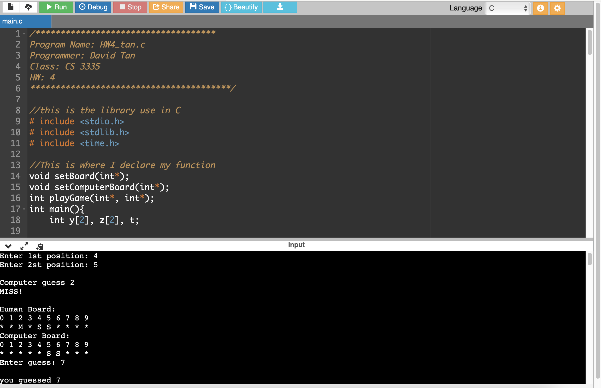
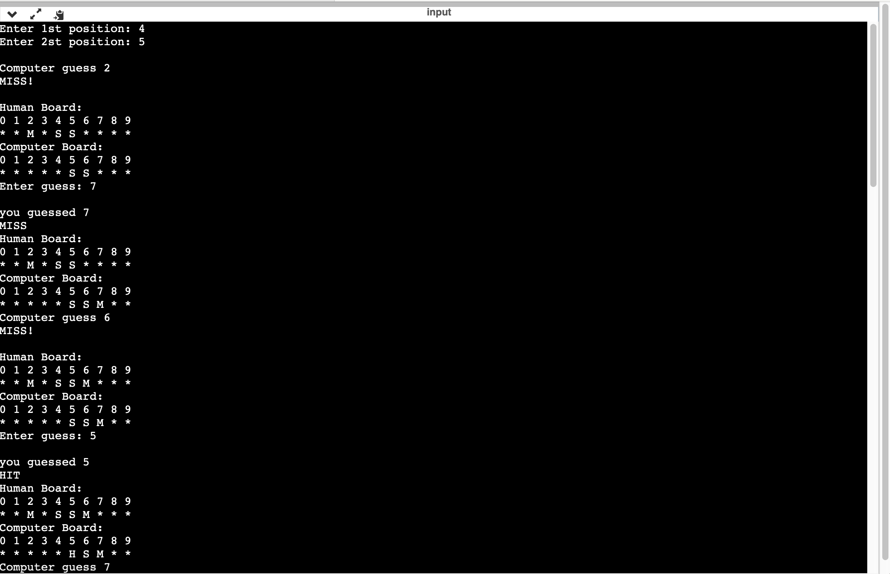
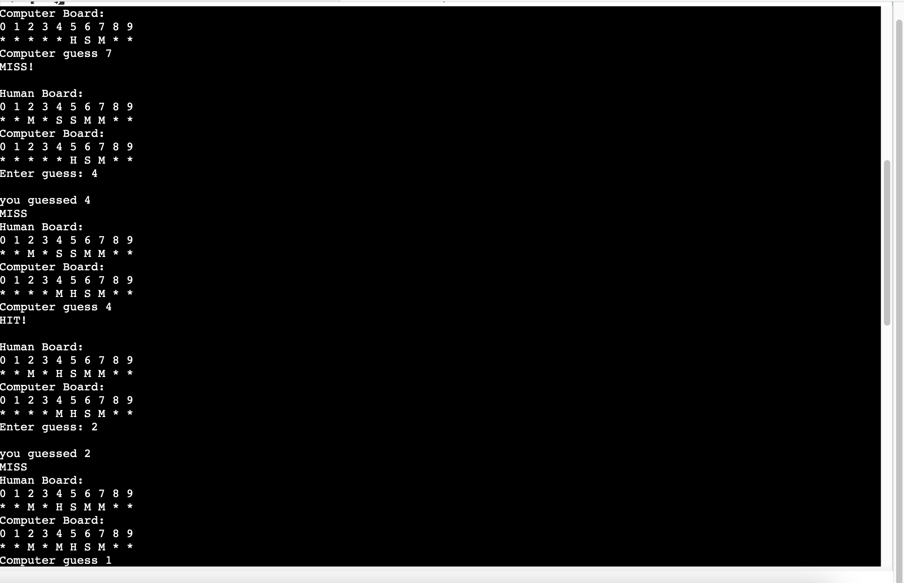
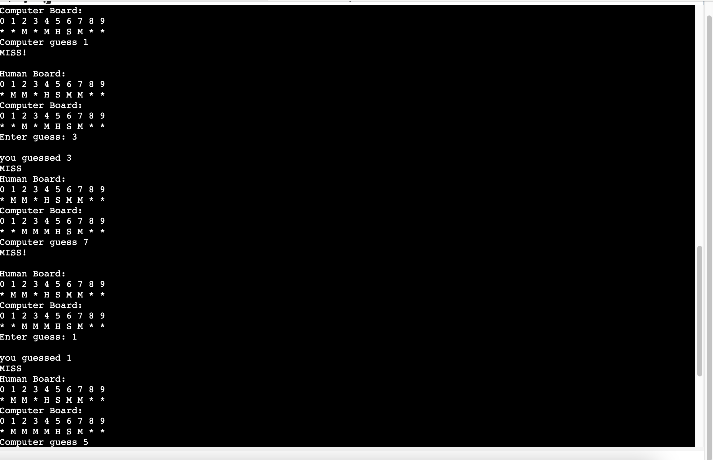

# Title: Battleship Situmulation Game

## Coding Language: 
I coded this in C

## Purpose: 
In this program, I will be mimicking a game of Battleship. My game board is a line of 10 slots. I  have to implement 3 methods. 

## Here is a Live Demo:

## How to install:
1. Go to file `code`
2. Downnload the code.
3. Make sure you have C programming sdk components install on your computer.
4. Or use a online compiler to run the code.

## Output Screenshot:

